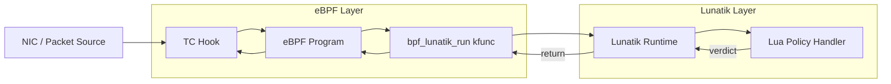

# Lunatik eBPF Abstraction Layer

I chose this project because it sits at the intersection of two things I find
genuinely interesting:
- eBPF
- Lua

After studying the Lunatik codebase and the existing `luaxdp` binding, I spent
time surveying the Linux Traffic Control subsystem, eBPF program types, and the
limitations of the BPF verifier to understand what the right problem to solve
actually was. That process led me to a conclusion: **the value of new bindings is 
combinatory, not linear**. Each binding added to Lunatik multiplies
the scripting surface available. `luatc` alone is not the point. 

A generic, reusable `bpf_lunatik_run()` layer that makes every future binding
easier will be a better value addition to Lunatik ecosystem.

This paired with an API to interact with eBPF maps will complete this project.
The goal is to make Lunatik compatible with eBPF programs so we can script
the kernel in more ways.

---

## Project Description

### The Problem With eBPF Alone

eBPF has become the dominant mechanism for extending the Linux kernel at
runtime. It is fast, safe (verifier-enforced), and increasingly expressive. But
it has a fundamental constraint: **the verifier bounds what you can express**.
No dynamic string operations. No pattern matching. No growable data structures.
No hot-swap of program logic without a full reload.

It is an architectural property of eBPF. Complex policy logic, the kind that 
operators actually need does not fit this model.

Enter Lua. Lua is small, embeddable, and designed for exactly this role: a
scripting language that extends a host system without replacing it. Lua is often
a glue language for the exisiting architecture. eBPF and Lua are not competitors,
we can make them complementary tools for different parts of the same problem.

### Idea: eBPF as Structure, Lua as Policy

The design philosophy of this project follows the pattern established by `luaxdp`:



- **eBPF programs define the points of interest**: fast-path, packet parsing,
  the conditions under which policy logic is needed.
- **`bpf_lunatik_run()` is the weaving point**: execution suspends, control
  passes to Lua, a verdict is returned, execution resumes.
- **Lua scripts define the policy**: string matching, pattern tables, dynamic
  rules, hot-reloadable without recompiling or reloading any BPF program.

eBPF = structure + safe hooks

Lua  = dynamic policy engine

Currently, `luaxdp` implements this pattern but it is **tightly coupled to XDP**. 
The kfunc `bpf_luaxdp_run()` is registered only for `BPF_PROG_TYPE_XDP` and 
receives an `xdp_md` context. 

This project aims to generalize that design.

---

### Component 1: Generic `bpf_lunatik_run()` Layer

Shared internal function that any type-specific kfunc can call:

```c
typedef int (*lunatik_bpf_cb)(lua_State *L, void *ctx);

int lunatik_bpf_run(const char *runtime_name, lunatik_bpf_cb push_ctx, void *ctx);
```

This function:
1. Looks up the named Lunatik runtime
3. Calls `push_ctx(L, ctx)` to push the context onto the Lua stack as a typed userdata
4. Invokes the registered Lua handler
5. Reads and returns the verdict

Type-specific kfuncs then become thin wrappers:

```c
// bpf_luaxdp_run will get refactored, behaviour unchanged
__bpf_kfunc int bpf_luaxdp_run(struct xdp_md *ctx, ...)
{
    return lunatik_bpf_run(runtime, luaxdp_push_ctx, ctx);
}

// bpf_luatc_run will be a new addition
__bpf_kfunc int bpf_luatc_run(struct __sk_buff *skb, ...)
{
    return lunatik_bpf_run(runtime, luatc_push_ctx, skb);
}
```

Each kfunc is registered for its specific `bpf_prog_type` via
`BTF_KFUNCS_START` / `BTF_KFUNCS_END`, maintaining verifier safety.

---

### Component 2: TC Binding (`luatc`)

Traffic Control is the primary demonstration of the generic layer. TC operates
on `__sk_buff` and is the place in the kernel with several capabilities:

- `tc_classid`: direct assignment to HTB qdisc classes for traffic shaping
- `struct bpf_sock *sk`: socket identity, enabling `bpf_skb_cgroup_id()` for
  per-container/per-process policy (TC egress only, unavailable at XDP)
- `tstamp`: packet transmit timestamp for pacing
- `priority`, `tc_index`, `mark`: classification metadata

None of these are available at XDP. TC is where shaping decisions are made.
Lua is where complex policy logic: string matching, pattern tables,
dynamic rules, is expressed. The two are complementary.

#### `luatc_data` Userdata

The `__sk_buff` is exposed to Lua as a `luatc_data` userdata:

```lua
pkt[i]           -- raw byte at offset i (skb->data)
pkt:len()        -- skb->len
pkt.mark         -- skb->mark           (r/w)
pkt.priority     -- skb->priority       (r/w)
pkt.tc_index     -- skb->tc_index       (r/w)
pkt.tc_classid   -- skb->tc_classid     (r/w)
pkt.protocol     -- skb->protocol       (r)
pkt.tstamp       -- skb->tstamp         (r/w)
```

#### `tc` Lua Module

```lua
local tc = require("tc")

tc.action.OK          -- TC_ACT_OK         = 0
tc.action.RECLASSIFY  -- TC_ACT_RECLASSIFY = 1
tc.action.SHOT        -- TC_ACT_SHOT       = 2
tc.action.PIPE        -- TC_ACT_PIPE       = 3
tc.action.STOLEN      -- TC_ACT_STOLEN     = 4
tc.action.REDIRECT    -- TC_ACT_REDIRECT   = 7

tc.attach(handler)    -- register Lua callback
tc.detach()           -- unregister
```

---

### Component 3: Examples using tc and Lua

1. Multi field egress classification

TC filters classify packets into HTB classes, but existing classifiers (u32, flower) 
can only match static L3/L4 fields. They cannot combine multiple fields with 
conditional logic. Operators are forced into this pattern:
```shell
iptables -t mangle -A POSTROUTING -p tcp --dport 443 -j MARK --set-mark 0x1
iptables -t mangle -A POSTROUTING -p udp --dport 53  -j MARK --set-mark 0x1
tc filter add dev eth0 parent 1:0 handle 0x1 fw classid 1:10
```
Problems with this:

- Requires iptables and tc: two subsystems to configure
- Port-based only, cannot combine port + protocol + packet size + DSCP
- Static, adding a new rule requires editing iptables and reloading
- IPv6 variable headers break u32 offset-based matching

This can be conveniently solved via a Lua policy handler.

```lua
-- qos.lua
local tc = require("tc")

local policy = {
    -- realtime: VoIP and gaming
    {
        match = function(p)
            return p.protocol == 0x0800          -- IPv4
               and p:ip_proto() == 17            -- UDP
               and p.len < 256                   -- small packet
               and (p:dscp() == 46               -- DSCP Expedited Forwarding
                    or p.priority >= 6)          -- SO_PRIORITY high
        end,
        classid = 0x00010010   -- 1:10 realtime
    },

    -- bulk: large TCP segments, likely file transfer or backup
    {
        match = function(p)
            return p.protocol == 0x0800
               and p:ip_proto() == 6             -- TCP
               and p.len > 1400                  -- near-MTU = bulk transfer
               and p.priority == 0               -- no special priority set
        end,
        classid = 0x00010030   -- 1:30 bulk
    },

    -- interactive: SSH, DNS
    {
        match = function(p)
            local dport = p:dst_port()
            return dport == 22                   -- SSH
                or dport == 53                   -- DNS
                or dport == 123                  -- NTP
        end,
        classid = 0x00010010   -- 1:10 realtime
    },
}

local function handler(pkt)
    for _, rule in ipairs(policy) do
        if rule.match(pkt) then
            pkt.tc_classid = rule.classid
            return tc.action.OK
        end
    end
    return tc.action.OK
end

tc.attach(handler)
```

2. DNS-Based Traffic Shaper

**The problem**: Shape traffic to streaming services (Netflix, YouTube) and
video conferencing (Zoom) into separate HTB classes, without a userspace
daemon, without static IP lists that go stale as CDNs rotate addresses.

**Why existing tools fail**: DNS responses reveal which IPs belong to which
domain. But DNS name parsing requires string operations (length-prefixed wire
format labels, pattern matching against domain names) that the BPF verifier
cannot express. Plain `tc u32` filters work on L3/L4 fields only. A userspace
daemon can parse DNS but introduces latency and race conditions between the DNS
response and the first data packet.

**The luatc solution**: eBPF pre-filters for DNS responses (port 53, UDP).
`bpf_luatc_run()` is called only for those packets, a low-frequency event.
Lua parses the DNS wire-format name and matches it against a policy table using
`string.match`. All other traffic takes the pure eBPF fast path.

#### TC Setup

```bash
tc qdisc del dev eth0 root 2>/dev/null
tc qdisc add dev eth0 root handle 1: htb default 30

tc class add dev eth0 parent 1: classid 1:10 htb rate 20mbit  # realtime
tc class add dev eth0 parent 1: classid 1:20 htb rate 10mbit  # streaming
tc class add dev eth0 parent 1: classid 1:30 htb rate 5mbit   # bulk/default

tc filter add dev eth0 ingress bpf da obj luatc_dns.o sec classifier
```

#### eBPF Program

```c
SEC("classifier")
int luatc_dns_shaper(struct __sk_buff *skb)
{
    if (!is_dns_response(skb)) {
        __u32 dst_ip = get_dst_ip(skb);
        __u32 *classid = bpf_map_lookup_elem(&ip_class_map, &dst_ip);
        if (classid)
            skb->tc_classid = *classid;
        return TC_ACT_OK;
    }

    // slow path: DNS response — delegate to Lua for string matching
    struct bpf_luatc_arg arg = { .offset = 42 }; // eth+ip+udp
    return bpf_luatc_run(skb, &arg, sizeof(arg));
}
```

#### Lua Policy Script

```lua
local tc  = require("tc")

-- Policy: Lua patterns -> TC classid
-- BPF C cannot express this: no string ops, no regex, no dynamic tables
local policy = {
    { pattern = "%.zoom%.us$",         classid = 0x00010010 },
    { pattern = "%.webex%.com$",       classid = 0x00010010 },
    { pattern = "%.netflix%.com$",     classid = 0x00010020 },
    { pattern = "%.nflxvideo%.net$",   classid = 0x00010020 },
    { pattern = "%.youtube%.com$",     classid = 0x00010020 },
    { pattern = "%.googlevideo%.com$", classid = 0x00010020 },
    { pattern = "s3%.amazonaws%.com$", classid = 0x00010030 },
}

local function parse_dns_name(pkt, offset)
    local labels, i = {}, offset
    while i < 512 do
        local len = pkt[i]
        if len == 0 or len >= 0xC0 then break end
        local label = {}
        for j = i+1, i+len do label[#label+1] = string.char(pkt[j]) end
        labels[#labels+1] = table.concat(label)
        i = i + len + 1
    end
    return table.concat(labels, ".")
end

local function handler(pkt, arg)
    local domain = parse_dns_name(pkt, arg.offset + 12)
    for _, rule in ipairs(policy) do
        if domain:match(rule.pattern) then
            pkt.tc_classid = rule.classid
            return tc.action.OK
        end
    end
    return tc.action.OK
end

tc.attach(handler)
```

#### Why Lua Is Justified Here

| Requirement | BPF C | Lua via `bpf_luatc_run` |
|---|---|---|
| DNS wire-format name parsing | Verbose, fragile | Natural with `string.char` |
| Domain pattern matching (`%.zoom%.us$`) | Not possible | Native `string.match` |
| Hot-reload policy without BPF reload | Not possible | `lunatik run new_policy` |
| Set `tc_classid` for HTB shaping | Possible | `pkt.tc_classid = x` |

Lua is invoked **only for DNS responses** perhaps a few packets per second.
All other traffic takes the pure eBPF fast path. The kfunc overhead is paid
only where Lua's capabilities are genuinely needed.

---

### Subsystems That Benefit Beyond TC

The generic `bpf_lunatik_run()` layer enables future bindings across the eBPF
program type space. The most compelling candidates, in priority order:

**`BPF_PROG_TYPE_CGROUP_SKB`**: the strongest next candidate after TC.
`cgroup_skb` programs receive a `__sk_buff` context identical to TC, operating
at the cgroup boundary on ingress and egress. The use case is per-container 
bandwidth enforcement with Lua policy.

**`BPF_PROG_TYPE_KPROBE`**: attaches Lua callbacks to arbitrary kernel
function entry/return points. This extends Lunatik from a networking scripting
tool to a general kernel scripting tool. Write Lua functions that fire
on scheduler events, file system calls, or memory allocation events and apply
dynamic policy.

**`BPF_PROG_TYPE_TRACEPOINT`**: attaches Lua callbacks to pre-defined kernel
tracepoints. Enables scriptable kernel observability: a Lua script processes
tracing events dynamically, performing aggregation or filtering that would
otherwise require recompiling a BPF program.

**`BPF_PROG_TYPE_CGROUP_SOCK_ADDR`**: triggered when a process calls `bind`
or `connect`. With Lua: dynamic connection policy per container, with pattern
matching on addresses and ports, hot-reloadable without kernel changes.

Each of these is a future binding, not in scope for this GSoC project. But the
generic `bpf_lunatik_run()` layer makes each of them straightforward to add.
This is precisely the combinatory effect that justifies the infrastructure
investment.

---

### Stretch Goal: eBPF Maps Module

To fully use the bpf ecosystem via Lunatik, another value addition would be
an **eBPF maps module for Lunatik**. This will allow Lunatik to have:

- **Stateful policies**: a Lua DNS handler writes `{ip -> classid}` to a map;
  the eBPF fast path reads it
- **Cross-binding composition**: `luaxdp` writes to a map that `luatc` reads,
  enabling pipelines that span subsystems
- **Operator visibility**: Lua scripts read kernel maps to inspect state without
  a separate userspace tool

```lua
local map = require("ebpf.map")

local flow_table = map.open("ip_class_map")
local classid = flow_table:lookup(dst_ip)
flow_table:update(src_ip, new_classid)
flow_table:delete(stale_ip)
```

---

## Implementation Plan

### Phase 1 — Generic layer and refactor (Weeks 1–4)
- Implement `lunatik_bpf_run()` internal function in `lunatik_bpf.c`
- Refactor existing `bpf_luaxdp_run()` to use it (no behaviour change)
- Write regression tests for luaxdp to confirm refactor is clean
- Document the generic layer API for future binding authors

### Phase 2 — TC binding (Weeks 5–9)
- Implement `luatc_data` userdata wrapping `__sk_buff`
  - Byte accessor `pkt[i]`
  - Field accessors: `len`, `mark`, `priority`, `tc_index`, `tc_classid`,
    `protocol`, `tstamp`
- Implement `bpf_luatc_run()` kfunc registered for `BPF_PROG_TYPE_SCHED_CLS`
- Implement `tc` Lua module: `attach`, `detach`, `action` constants
- Makefile, BTF export, integration with Lunatik build system

### Phase 3 — Example and documentation (Weeks 10–11)
- `examples/dns_shaper/`: complete working eBPF program + Lua policy script
- Docker-based test (same pattern as `luaxdp` filter example)
- README and inline documentation

### Phase 4 — eBPF maps module (Week 12, stretch goal)
- Generic Lunatik module for eBPF map CRUD from Lua
- `map.open()`, `lookup()`, `update()`, `delete()`
- Integration test: DNS shaper with map-based IP→classid caching

---

## Why This Project, In One Paragraph

Linux is going all the way with eBPF. That is a fact. But eBPF optimises for
verifiability and performance, not expressiveness. The BPF verifier is a
constraint, not just a safety mechanism — it bounds what policy logic you can
write. Lua does not have that constraint. It is small enough to live in the
kernel, flexible enough to express the policy logic eBPF cannot, and simple
enough that operators who cannot write BPF C can write Lua scripts. The
`bpf_lunatik_run()` layer is the bridge: eBPF defines the structure, Lua
defines the policy. Each new binding added on top of this layer multiplies the
scripting surface available to the kernel. That combinatory effect is the reason
this infrastructure matters.
