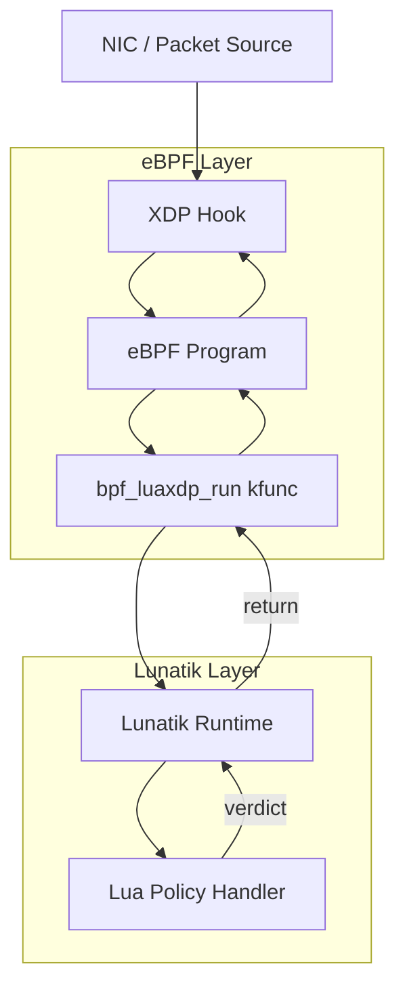

# Lunatik eBPF Abstraction Layer

Lunatik has support for [XDP](https://en.wikipedia.org/wiki/Express_Data_Path) through its
[xdp](https://luainkernel.github.io/lunatik/modules/xdp.html) module

After studying the Lunatik codebase and the existing [luaxdp](https://github.com/luainkernel/lunatik/blob/master/lib/luaxdp.c)
binding, I spent time surveying the Linux Traffic Control subsystem
([here](https://gist.github.com/sneaky-potato/72e6fffca5b035f60a4ca391922e1224)), eBPF program 
types, and the limitations of the BPF verifier to understand what the right problem to solve
actually was.

LuaXDP uses eBPF as a layer to integrate Lua callbacks ([reference here](https://victornogueirario.github.io/xdplua/)).
TC would use something like that only. The reason being: XDP does not allow
Linux kernel modules to be called directly. At present it is only extensible through
eBPF. So an eBPF layer is essential for now.

Same story goes for TC. Since an eBPF layer cannot be eliminated completely and 
a lot of code from luaxdp would be used in this binding as well.

That process led me to a conclusion: **the value of new bindings is combinatory,
not linear**. Each binding added to Lunatik multiplies the scripting surface 
available. `luatc` alone is not the point.

A generic, reusable `lunatik_bpf_run()` layer that makes every future binding
easier will be a better value addition to Lunatik ecosystem.

This paired with an API to interact with eBPF maps will complete this project.
The goal is to make Lunatik compatible with eBPF programs so we can script
the kernel in more ways.

---

## Project Description

### The Problem With eBPF Alone

eBPF has become the dominant mechanism for extending the Linux kernel at
runtime. It is fast, safe (verifier-enforced), and increasingly expressive. But
it has a fundamental constraint: **the verifier bounds what you can express**.
No dynamic string operations. No pattern matching. No growable data structures.
No hot-swap of program logic without a full reload.

It is an architectural property of eBPF. Complex policy logic, the kind that 
operators actually need does not fit this model.

Enter Lua. Lua is small, embeddable, and designed for exactly this role: a
scripting language that extends a host system without replacing it. Lua is often
a glue language for the exisiting architecture. eBPF and Lua are not competitors,
we can make them complementary tools for different parts of the same problem.

### Idea: eBPF as Structure, Lua as Policy

The design philosophy of this project follows the pattern established by `luaxdp`:



- **eBPF programs define the points of interest**: fast-path, packet parsing,
  the conditions under which policy logic is needed.
- **`bpf_luaxdp_run()` is the weaving point**: execution suspends, control
  passes to Lua, a verdict is returned, execution resumes.
- **Lua scripts define the policy**: string matching, pattern tables, dynamic
  rules, hot-reloadable without recompiling or reloading any BPF program.

eBPF = structure + safe hooks

Lua  = dynamic policy engine

Currently, `luaxdp` implements this pattern but it is **tightly coupled to XDP**. 
The kfunc `bpf_luaxdp_run()` is registered only for `BPF_PROG_TYPE_XDP` and 
receives an `xdp_md` context. 

This project aims to generalize that design.

---

## Core Components

### Generic `lunatik_bpf_run()` Layer

Since eBPF programs cannot call arbitrary kernel functions, the Linux kernel
provides kfuncs as a mechanism for exposing functionality to BPF programs. 
These functions are registered with the BPF subsystem using BTF-based kfunc 
registration, which allows the verifier to enforce safety constraints.

The eBPF docs mention a list of kfuncs here: https://docs.ebpf.io/linux/kfuncs/,
This could provide with inspiration for future kfunc support by Lunatik.


#### Kfunc registration

```c
__bpf_kfunc int bpf_luaxdp_run(struct xdp_md *ctx, ...);
__bpf_kfunc int bpf_luatc_run(struct __sk_buff *skb, ...);
```

The functions are then registered with the BPF subsystem.

```c
BTF_KFUNCS_START(bpf_luatc_set)
BTF_ID_FLAGS(func, bpf_luatc_run)
BTF_KFUNCS_END(bpf_luatc_set)
```

Finally, during module initialization, the kfunc set is registered with the kernel for the relevant BPF program type:
```c
register_btf_kfunc_id_set(
    BPF_PROG_TYPE_SCHED_CLS,
    &bpf_luatc_kfunc_set
);
```

This restricts them to specific program types such as `BPF_PROG_TYPE_SCHED_CLS`.

#### Generic interface

Shared internal function that any type-specific kfunc can call:

```c
typedef int (*lunatik_bpf_cb)(lua_State *L, void *ctx);

int lunatik_bpf_run(const char *runtime_name, lunatik_bpf_cb push_ctx, void *ctx);
```

This function:
1. Looks up the named Lunatik runtime
2. Calls `push_ctx(L, ctx)` to push the context onto the Lua stack as a typed userdata
3. Invokes the registered Lua handler
4. Reads and returns the verdict

Type-specific kfuncs then become thin wrappers:

```c
// bpf_luaxdp_run will get refactored, behaviour unchanged
__bpf_kfunc int bpf_luaxdp_run(struct xdp_md *ctx, ...)
{
    return lunatik_bpf_run(runtime, luaxdp_push_ctx, ctx);
}

// bpf_luatc_run will be a new addition
__bpf_kfunc int bpf_luatc_run(struct __sk_buff *skb, ...)
{
    return lunatik_bpf_run(runtime, luatc_push_ctx, skb);
}
```

The `runtime` parameter allows multiple Lua runtimes to coexist, enabling different 
TC classifiers to delegate processing to different Lua handlers.

Each kfunc is registered for its specific `bpf_prog_type` via
`BTF_KFUNCS_START` / `BTF_KFUNCS_END`, maintaining verifier safety.

### Traffic Control Binding (luatc)

Traffic Control is the primary demonstration of the generic layer. TC operates
on `__sk_buff` and is the place in the kernel with several capabilities:

- `tc_classid`: direct assignment to HTB qdisc classes for traffic shaping
- `tstamp`: packet transmit timestamp for pacing
- `priority`, `tc_index`, `mark`: classification metadata

None of these are available at XDP. TC is where shaping decisions are made.
Lua is where complex policy logic: string matching, pattern tables,
dynamic rules, is expressed.

We can extend the recently merged `luaskb` module which provides an
abstraction to `__sk_buff` data structure:
```lua
skb.mark         -- skb->mark           (r/w)
skb.priority     -- skb->priority       (r/w)
skb.tc_index     -- skb->tc_index       (r/w)
skb.tc_classid   -- skb->tc_classid     (r/w)
skb.protocol     -- skb->protocol       (r)
skb.tstamp       -- skb->tstamp         (r/w)
```

```lua
local tc = require("tc")

tc.action.OK          -- TC_ACT_OK         = 0
tc.action.RECLASSIFY  -- TC_ACT_RECLASSIFY = 1
tc.action.SHOT        -- TC_ACT_SHOT       = 2
tc.action.PIPE        -- TC_ACT_PIPE       = 3
tc.action.STOLEN      -- TC_ACT_STOLEN     = 4
tc.action.REDIRECT    -- TC_ACT_REDIRECT   = 7

tc.attach(handler)    -- register Lua callback
tc.detach()           -- unregister
```

### eBPF Maps Module

To fully use the bpf ecosystem via Lunatik, we need access to shared kernel
state. Hence support for *eBPF maps module for Lunatik* is important,
this will allow Lunatik to have:

- *Stateful policies*: a Lua handler writes `{ip -> classid}` to a map;
  the eBPF fast path reads it
- *Cross-binding composition*: `luaxdp` writes to a map that `luatc` reads,
  enabling pipelines that span subsystems
- *Operator visibility*: Lua scripts read kernel maps to inspect state without
  a separate userspace tool

```lua
local map = require("ebpf.map")

local flow_table = map.open("/sys/fs/bpf/flow_cache")
local classid = flow_table:lookup(dst_ip)
flow_table:update(src_ip, new_classid)
flow_table:delete(stale_ip)
```

eBPF maps are created via `bpf(BPF_MAP_CREATE, ...)` and accessed via
`bpf_map_lookup_elem`, `bpf_map_update_elem`, and `bpf_map_delete_elem` helpers.
We want to access these via kernel's internal map API without going through syscall
interface.

The following APIs are exposed by kernel to use:
- All userspace calls (through libbpf) go through [`SYSCALL_DEFINE3()`](https://elixir.bootlin.com/linux/v6.19.2/source/kernel/bpf/syscall.c#L6272)
- [`bpf_map_get(u32 ufd)`](https://elixir.bootlin.com/linux/v6.19.2/source/include/linux/bpf.h#L2487)
- [`bpf_map_get_with_uref(u32 ufd)`](https://elixir.bootlin.com/linux/v6.19.2/source/include/linux/bpf.h#L2488)

`bpf_map_get` will need the file descriptor which needs to be created via
a process context.

#### Map Creation
This design requires bpf maps to be created outside Lunatik, via userspace 
programs like `bpftool`.

```
bpftool map create /sys/fs/bpf/flow_cache type hash key 4 value 4 entries 128 name flow_cache
```

#### Map Lookup and usage
Map resolution happens once during script initialization via open(path), which
runs in process context inside `driver:write()`. The resolved `struct bpf_map*` is
stored in a Lua userdata and reused by all subsequent lookup/update/delete
calls. These are safe to call from softirq. 

bpffs intentionally blocks `filp_open` on pinned objects.
Instead we use `kern_path` to resolve the dentry without triggering the open
handler, then read `inode->i_private` directly where bpffs stores the `struct
bpf_map*`. 

> [!NOTE]
> This has been verified via a kernel module POC.

```c
static int luabpf_map_open(lua_State *L)
{
    const char *path = luaL_checkstring(L, 1);
    struct path kpath;
    struct bpf_map *map;
    struct bpf_map **udata;
    int err;

    err = kern_path(path, LOOKUP_FOLLOW, &kpath);
    if (err)
        return luaL_error(L, "kern_path failed: %d", err);

    map = d_inode(kpath.dentry)->i_private;
    path_put(&kpath);

    if (!map || IS_ERR(map))
        return luaL_error(L, "not a valid bpf map path");

    bpf_map_inc(map); // increase reference counter

    udata = lua_newuserdata(L, sizeof(struct bpf_map *));
    *udata = map;
    luaL_setmetatable(L, "bpf.map");
    return 1;
}
```

- `lookup(key)` on the map pointer will return the value stored in the map for the provided key. We can reuse `luadata` for the actual types.
- `update(key, data)` on the map pointer will update the map for the provided key with the given data.
- `delete(key)` on the map pointer will delete the key from the map.
- Once we have the pointer to `struct bpf_map`, we could call kernel ops helpers defined [here](https://elixir.bootlin.com/linux/v6.19.2/source/include/linux/bpf.h#L106) to do lookup, update, delete.

#### Cleanup
- `close()` will cleanup the map from Lua, and decrease the reference counter via [`bpf_map_put(struct bpf_map *map)`](https://elixir.bootlin.com/linux/v6.19.2/source/include/linux/bpf.h#L2521)

### First Packet Classification

1. Setup TC
```shell
tc qdisc del dev eth0 root 2>/dev/null
tc qdisc add dev eth0 root handle 1: htb default 30

tc class add dev eth0 parent 1: classid 1:10 htb rate 20mbit  # realtime
tc class add dev eth0 parent 1: classid 1:20 htb rate 10mbit  # streaming
tc class add dev eth0 parent 1: classid 1:30 htb rate 5mbit   # bulk/default

tc filter add dev eth0 ingress bpf da obj tc.bpf.o sec classifier
```

2. eBPF program
```c
extern int bpf_luatc_run(char *key, size_t key__sz, struct __sk_buff *skb, void *arg, size_t arg__sz) __ksym;

SEC("tc")
int tls_classifier(struct __sk_buff *skb)
{
    struct flow_key key = extract_key(skb);
    // key could be made from src_ip, dst_ip, src_port, dst_port, ip_proto
    // We could also timestamp the cache entried to handle TCP port reuse.

    __u32 *classid = bpf_map_lookup_elem(&flow_cache, &key);
    if (classid) {
        skb->tc_classid = *classid;
        return TC_ACT_OK;
    }

    // only invoke Lua if this looks like a TLS ClientHello
    if (!is_tls_client_hello(skb))
        return TC_ACT_OK;

    return bpf_luatc_run(runtime, sizeof(runtime), skb, NULL, 0);
}
```

3. Lua policy handler
```lua
local tc  = require("tc")
local map = require("ebpf.map")

local cache = map.open_by_id(FLOW_CACHE_ID)

local policy = {
    ["netflix%.com$"]       = 0x00010030,  -- bulk
    ["meet%.google%.com$"]  = 0x00010010,  -- realtime
    ["%.zoom%.us$"]         = 0x00010010,  -- realtime
    ["%.backup%.internal$"] = 0x00010040,  -- background
}

local function parse_sni(p)
    -- get sni from the packet
end

local function is_tls_hello(p)
    -- check if the packet is TLS hello
end

local function handler(p)
    if not is_tls_hello(p) then return tc.action.OK end

    local sni = parse_sni(p)
    if not sni then return tc.action.OK end

    for pattern, classid in pairs(policy) do
        if sni:match(pattern) then
            cache:update(p:flow_key(), classid)
            p.tc_classid = classid
            return tc.action.OK
        end
    end

    return tc.action.OK
end

tc.attach(handler)
```

---

## Benchmarks and Evaluation

I have tried writing a TC implementation similar to XDP in
`sneaky-potato/luatc` branch of the project. Link [here](https://github.com/luainkernel/lunatik/tree/sneaky-potato/luatc)

I tested two scenarios: pure eBPF program emitting `TC_ACT_OK`
for each packet and one eBPF program calling `bpf_tc_run` which
returns `tc.action.OK` for each packet.

I attached the following kprobe to measure latency.

```
sudo bpftrace -e '
kprobe:tcf_classify { @start[tid] = nsecs; }
kretprobe:tcf_classify {
    if (@start[tid]) {
        @lat = hist(nsecs - @start[tid]);
        delete(@start[tid]);
    }
}'
```

The results:
| Metric Percentile | eBPF | eBPF + Lua TC |
| --- | --- | --- |
| p50 | ~3µs  | ~6µs  |
| p90 | ~6µs  | ~12µs |
| p99 | ~20µs | ~40µs |

Pure eBPF path
```
@lat:
[128, 256)            36 |                                                    |
[256, 512)           125 |@@                                                  |
[512, 1K)            251 |@@@@@                                               |
[1K, 2K)             797 |@@@@@@@@@@@@@@@@                                    |
[2K, 4K)            2500 |@@@@@@@@@@@@@@@@@@@@@@@@@@@@@@@@@@@@@@@@@@@@@@@@@@@@|
[4K, 8K)            1737 |@@@@@@@@@@@@@@@@@@@@@@@@@@@@@@@@@@@@                |
[8K, 16K)            255 |@@@@@                                               |
[16K, 32K)            60 |@                                                   |
[32K, 64K)            20 |                                                    |
```

eBPF classifier calling `bpf_luatc_run`
```
@lat:
[512, 1K)              8 |                                                    |
[1K, 2K)             118 |@@                                                  |
[2K, 4K)             270 |@@@@@@                                              |
[4K, 8K)            2216 |@@@@@@@@@@@@@@@@@@@@@@@@@@@@@@@@@@@@@@@@@@@@@@@@@@@@|
[8K, 16K)           1655 |@@@@@@@@@@@@@@@@@@@@@@@@@@@@@@@@@@@@@@              |
[16K, 32K)           278 |@@@@@@                                              |
[32K, 64K)            13 |                                                    |
[64K, 128K)            1 |                                                    |
```

This hints to use Lua only when required, on slow paths.

### Future Subsystems That Benefit Beyond TC

The generic `lunatik_bpf_run()` layer enables future bindings across the eBPF
program type space. The most compelling candidates, in priority order:

**`BPF_PROG_TYPE_CGROUP_SKB`**: the strongest next candidate after TC.
`cgroup_skb` programs receive a `__sk_buff` context identical to TC, operating
at the cgroup boundary on ingress and egress. The use case is per-container 
bandwidth enforcement with Lua policy.

**`BPF_PROG_TYPE_KPROBE`**: attaches Lua callbacks to arbitrary kernel
function entry/return points. This extends Lunatik from a networking scripting
tool to a general kernel scripting tool. Write Lua functions that fire
on scheduler events, file system calls, or memory allocation events and apply
dynamic policy.

**`BPF_PROG_TYPE_TRACEPOINT`**: attaches Lua callbacks to pre-defined kernel
tracepoints. Enables scriptable kernel observability: a Lua script processes
tracing events dynamically, performing aggregation or filtering that would
otherwise require recompiling a BPF program.

**`BPF_PROG_TYPE_CGROUP_SOCK_ADDR`**: triggered when a process calls `bind`
or `connect`. With Lua: dynamic connection policy per container, with pattern
matching on addresses and ports, hot-reloadable without kernel changes.

Each of these is a future binding, not in scope for this GSoC project. But the
generic `lunatik_bpf_run()` layer makes each of them straightforward to add.
This is precisely the combinatory effect that justifies the infrastructure
investment.

---

## Why This Project?

I have always been interested in how computers works and how we can
tweak certain parts to get our job done. I find Lunatik very
interesting in the sense that it tries to achieve something bold:
kernel scripting with a high level language.

Lunatik helped me understand how Lua is actually a glue language
for already running systems. It is lightweight, embeddable, and
expressive enough to implement the dynamic logic.

Instead of building isolated bindings, the proposed infrastructure allows
future Lunatik modules across multiple subsystems to reuse the same
mechanism, multiplying the scripting capabilities of the kernel.

